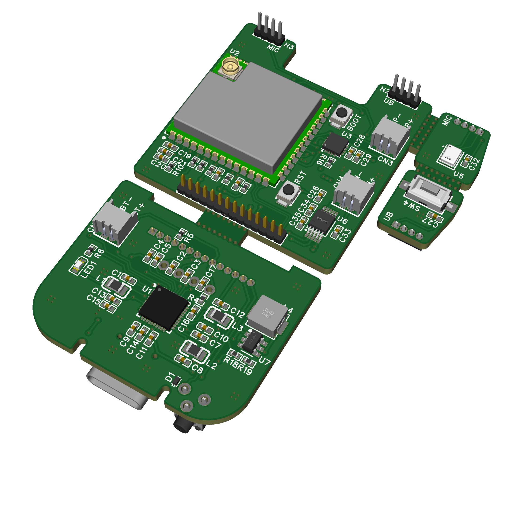

# Keero Bot Hardware



[](https://www.pcbway.com/)


The Keero Bot hardware platform is a modular embedded system for AI-oriented physical devices. It combines a reusable ESP32-S3 based mainboard with future-facing modules for docking, mobility, and richer interaction experiments.

## Project Overview

Keero Bot is being developed around a simple product idea:

- one compact core board
- multiple physical configurations through modules
- open firmware direction
- public architecture visibility
- controlled access to production-grade hardware data

This repository documents the hardware direction and platform structure without positioning the public release as a turnkey cloning package.

## Repository Structure

```text
keero-hardware/
├── mainboard/
├── modules/
└── assets/
```

## Mainboard

The mainboard is the central hardware layer of the platform. It combines:

- ESP32-S3 based compute
- camera, audio, haptics, and motion-oriented interaction support
- managed power for portable and docked use cases
- expansion interfaces for external modules

See: `mainboard/README.md`

## Modules

Keero Bot is designed as a modular system rather than a fixed one-board product. Current module directions include:

- dock
- tracks
- future accessory concepts

See: `modules/README.md`

## Manufacturing and Prototyping

The hardware has been prepared with real-world PCB prototyping in mind, which makes it suitable for sponsor review and manufacturing discussion.

At the same time, this public repository is intentionally selective. Production-critical design sources and full manufacturing release materials are not positioned here as unrestricted public deliverables.

## Open Hardware Position

Keero Bot follows a balanced release model:

- architecture is documented publicly
- firmware direction remains open
- official hardware production details are more controlled

This keeps the project open enough to understand and collaborate around, while reducing the risk of straightforward commercial copying of the official hardware.

## PCBWay

PCBWay is an especially relevant partner for a project like Keero Bot because the platform benefits from reliable prototyping, fast iteration, and professional PCB manufacturing support.

That partner fit helps communicate that Keero Bot is more than a concept. It is a serious hardware platform moving through real prototyping stages.

## Status

- Mainboard: active prototype
- Dock: concept and integration direction defined
- Tracks: mechanical and firmware direction in progress

## About Keero

Keero focuses on experimental AI hardware platforms that connect embedded systems with real-world interaction.


